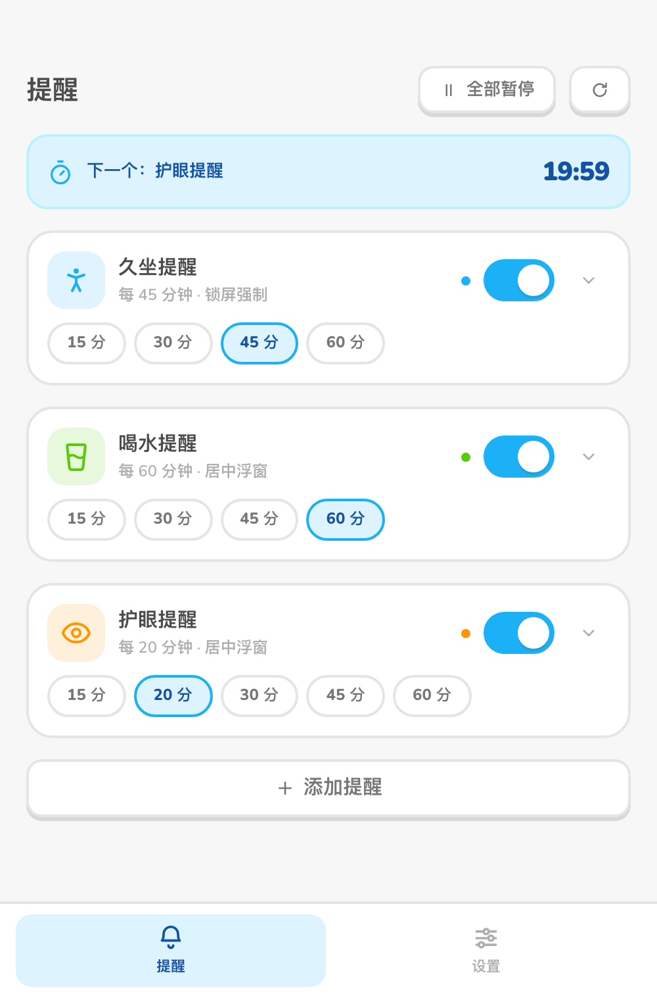
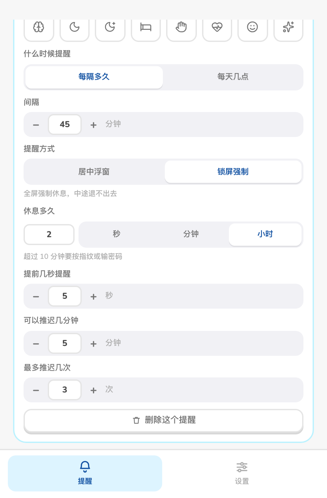
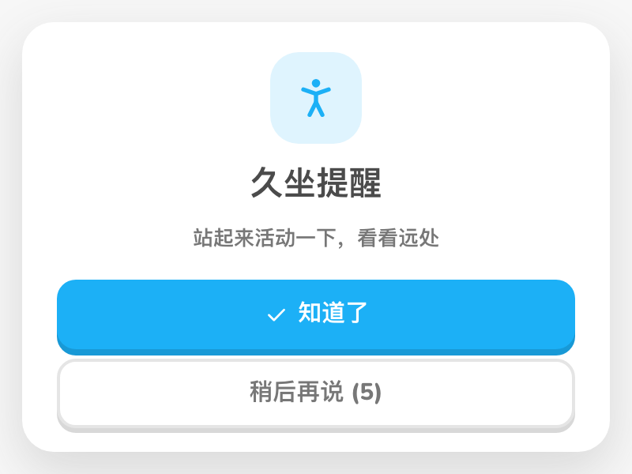
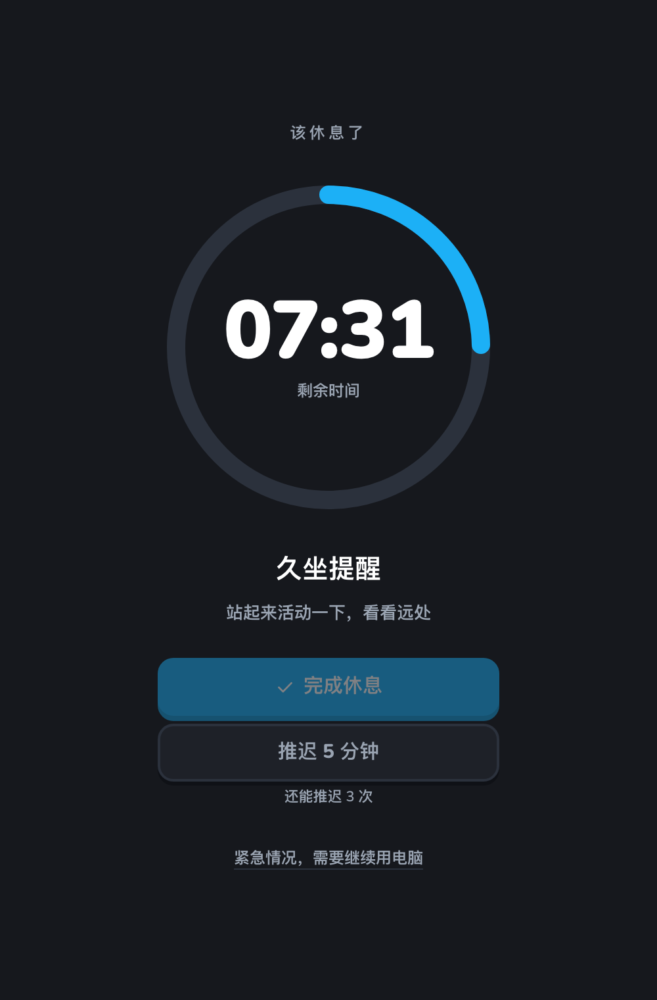
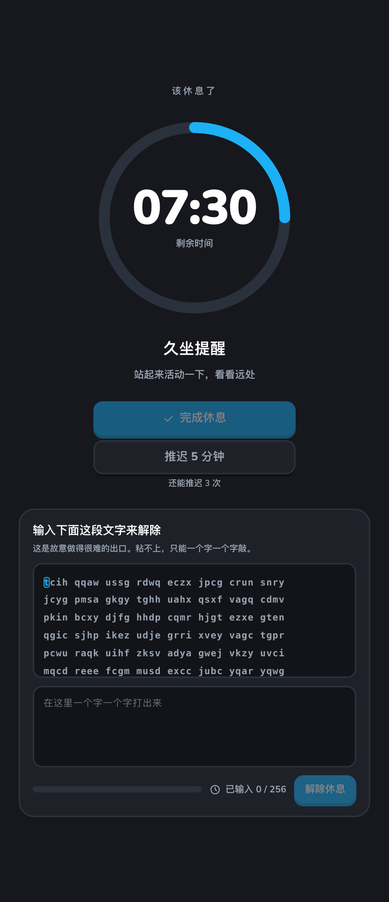
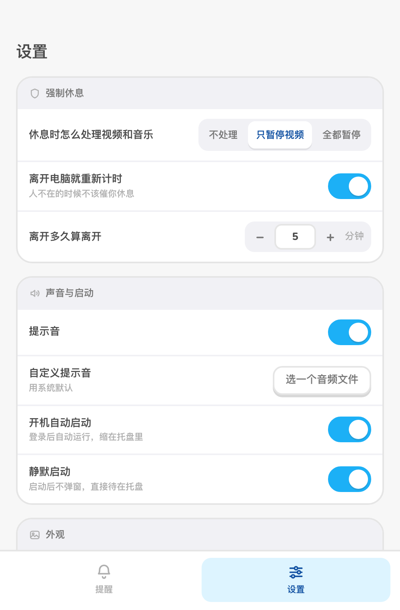

<h1 align="center">Hold On</h1>

<p align="center">
  <a href="https://tauri.app/"></a>
  <a href="LICENSE"></a>
  <a href="https://github.com/lokiand0628/huanhuan_hold-on/releases"></a>
</p>

<p align="center">
  Take it slow — no rush.
</p>

<p align="center">
  A health reminder you can't dismiss — when it fires, you rest
</p>

<p align="center">
  <a href="./README.md">中文</a> | <strong>English</strong>
</p>

> The application interface is Chinese-only. This English README covers the
> project as a whole; the full changelog lives in the [Chinese README](./README.md#版本记录).

---

## What it is

Ordinary reminder apps don't fix sitting too long, because **a reminder is something
your reflexes can dismiss** — it pops up, your eyes flick over it, your hand swipes it
away, you keep working.

**Hold On** treats that as the core problem. Each task picks its own reminder
strength:

- **Centered popup** (default): a borderless window in the middle of the desktop —
  always on top, absent from the taskbar, and it **only goes away when you click
  "Confirm"**. Ignore it and it stays there.
- **Forced lock screen**: full-screen takeover of every monitor, taking focus back.
  **Restarting doesn't get you out.** The rest duration is anchored to wall-clock time,
  so the minutes you spend rebooting still count.

It doesn't notify you. It makes you stand up.

> **Platform**: macOS only, and Apple Silicon (M-series) only. There are no Windows,
> Linux or Intel Mac builds.

## Screenshots

### Reminders

The main window has exactly two pages. A single countdown row at the top, then one card
per task: icon, name, interval, reminder mode, toggle — expand to edit.

<p align="center">
  
  
</p>

Quick-interval chips (15 / 30 / 45 / 60 min) sit right on the card, so changing an
interval doesn't require opening the editor first.

### Centered popup (default mode)

Borderless, centered, always on top, not in the taskbar. It disappears on "Confirm" —
or you can snooze it a few minutes.

<p align="center">
  
</p>

### Forced lock screen

Full-screen across every monitor. "Finish rest" stays disabled until the countdown
runs out — the exit only opens when the time is up.

<p align="center">
  
</p>

### Emergency exit

If something is genuinely urgent, the only way out is to **hand-type 256 random
letters**. The text can't be selected and paste is blocked — one character at a time.

<p align="center">
  
</p>

### Settings

Four groups, about ten options.

<p align="center">
  
</p>

---

## Why you need it

### 1. It actually makes you rest

- **Two strengths, chosen per task.** "Just mention it" tasks (water, eye rest) use the
  centered popup; "I have to stand up" tasks (sitting too long) use the forced lock
  screen. You don't have to turn the whole app into a tyrant for one task.
- **The popup can't be dismissed either.** It isn't an ordinary dialog — borderless,
  always on top, no taskbar entry, no close button, and `Cmd+W` is intercepted. Its
  only exits are "Confirm" and "Snooze N minutes".
- **Every monitor is covered.** Extended and mirrored displays are taken over together,
  so you can't move to a second screen and keep working; plugging or unplugging a
  display mid-rest is handled.
- **Enforcement tier.** Login item + background watchdog + persisted state + wall clock.
  While locked, **`Cmd+Q`, quitting from the tray, and `Cmd+Tab` all do nothing**.
- **Rebooting isn't an escape.** Rest progress is written to disk and measured against
  the system clock, so the time a forced restart costs you still counts.
- **Changing the clock doesn't help either.** A monotonic checkpoint is saved every ten
  seconds, so winding the system clock backwards doesn't shorten the rest.

### 2. Attentive, not annoying

- **Heads-up warning**: each task sets its own lead time, so you can finish the sentence
  you're on before the lock lands.
- **Controlled snoozing**: per-task snooze length and a maximum count — once the count is
  spent, only "Finish rest" is left.
- **Away from the computer? The timer resets.** It shouldn't nag you when you're not
  there, and it shouldn't fire the moment you sit back down.
- **Media handling at rest**: leave alone / pause video only / pause everything, three
  levels, music untouched by default.
- **Silent autostart**: launch at login and stay in the tray, no window on boot.

### 3. Simple to use

- **A real task system**: sitting, water and eye rest built in, plus any custom task;
  reminders run independently and in parallel.
- **Two scheduling modes**: every N minutes, or fixed times of day (e.g. 11:00 workout,
  21:00 soak your feet).
- **Per-task control**: start, pause and reset each task independently, and configure its
  interval, reminder mode, rest duration, lead time and snooze policy.
- **Rest for as long as you want**: seconds / minutes / hours, up to 12 hours. Want a
  two-hour rest? Pick "hours", type 2 — no 119 clicks on a plus button. Raising the
  duration above 10 minutes requires Touch ID or your login password; lowering it never
  does, because "I want to take it easy today" shouldn't be blocked by your own tool.
- **Bulk actions**: pause / resume / reset everything from the main window or the tray;
  the tray can also reset a single task.
- **Accurate background timing**: the timer runs on a Rust backend thread, unaffected by
  minimizing the window or by macOS App Nap.
- **A useful tray menu**: show the main window, pause or resume, reset tasks, restart and
  quit; hovering the tray icon lists the remaining time for each task.

---

## Design

The interface follows [Duolingo's brand guidelines](https://design.duolingo.com/)
(Friendly Geometry) — not a vague "rounded-ish" imitation:

- **Rounded geometry**: every shape has rounded corners, no sharp angles; pressable
  controls use a solid "contact" shadow (`0 Npx 0`) rather than a diffuse one.
- **Colours with distinct jobs**: blue = actionable / selected / primary button,
  green = completion and success, danger colour only for destructive actions. Identity
  colours appear only in icons and dots, never as a button background.
- **Tabular numerals**: every countdown uses `tabular-nums`, so it doesn't jitter as the
  seconds tick.
- **Bundled font**: Nunito (OFL, shipped inside the bundle) with a PingFang SC fallback —
  no runtime Google Fonts request.

---

## Architecture

Built for minimal memory use and startup time:

- **Backend**: [Rust](https://www.rust-lang.org/) (Tauri 2.0) — timing engine, lock-screen
  watchdog, multi-monitor takeover, platform capabilities.
- **Frontend**: [Vite](https://vitejs.dev/) + vanilla JavaScript (no framework, no runtime
  dependencies) — imperative DOM, no virtual-DOM overhead.
- **Communication**: Tauri IPC — timers don't depend on the interface repainting.
- **Styles**: CSS Variables — a single token layer (surface / ink / accent / state /
  identity / radius / depth / type / space / motion).

---

## Download and install

Grab `Huanhuan_0.0.3_aarch64.dmg` from
[GitHub Releases](https://github.com/lokiand0628/huanhuan_hold-on/releases), open it and
drag 缓缓 into Applications.

### If macOS refuses to open it

This build is **not signed with an Apple Developer certificate and not notarized**
(personal project; no $99/year account). So the first launch will say the developer
can't be verified, or that the app is damaged. Either fix works:

```bash
# Option 1: drop the download quarantine flag (recommended, once is enough)
xattr -dr com.apple.quarantine /Applications/缓缓.app
```

Option 2: right-click 缓缓 in Finder → "Open" → click "Open" again in the dialog.

> Nothing is broken — this is just Gatekeeper's default stance on any unnotarized app.
> If that bothers you, build it yourself from source (next section); a build you make
> locally isn't quarantined.

---

## Building from source

You'll need a Rust toolchain and Node.js. **The build target is Apple Silicon.**

### 1. Run in development

```bash
npm install
npm run tauri dev
```

Working on the interface only? Run `npm run dev` and open
`http://127.0.0.1:5173/?mock=1` — that mounts a fake backend (the timers are real; only
the window and system calls are stubbed), so you don't have to restart Rust to restyle
something.

### 2. Build an installer

```bash
npm run tauri build -- --target aarch64-apple-darwin --bundles dmg
```

---

## Update checks

The settings page has a "Check for updates" button that **only checks — it never
installs**. It asks GitHub for a newer tag and, if there is one, sends you to the release
page to download it yourself.

That's deliberate. The previous version shipped an auto-download-and-install updater,
which needs a signing key pair; the key wasn't ours to hold, and leaving it in place
could steer people into installing someone else's build. Slightly less convenient, in
exchange for not having to keep a private key and not installing the wrong thing.

---

## Roadmap

- [ ] Statistics view: weekly / monthly completion rates.
- [x] More sound options: custom reminder sounds.
- [ ] Focus-mode integration: stay quiet while you're full-screen in another app.

---

## Version history

### v0.0.3 (2026-10-11)

Fixes for issues that only showed up in real testing of v0.0.2.

- **The lock screen's snooze is no longer unlimited**: the snooze entitlement used to live in `lock.json`, but snoozing ends the whole lock session and deletes that file — so every round started from a full budget, "3 snoozes left" never changed, and it could be clicked forever. Snoozing is now **exactly once**, the same rule as the soft reminder: the lock that pops back after a snooze offers only "Finish break". The per-task "max snoozes" setting is gone with it — there is no count left to configure.
- **One click on "Got it" closes the popup**: macOS WebViews ignore the first click on an inactive window (it only brings the window to the front), so it took two. The popup now accepts the first mouse click.
- **Confirmed reminders no longer go silent**: "Got it" / "snooze" used to close the popup before reporting back to the backend — once the window was gone those calls were silently dropped, the task's `triggered` flag stuck at true, and that reminder **never fired again** (until a restart). The order is now: settle first, close the window last.

### v0.0.2 (2026-10-09)

Fixes for a handful of problems in v0.0.1 that only showed up in use.

- **Deleted tasks stay deleted**: after deleting every task, a restart brought the three
  built-in ones back. An empty list is now an empty list. (Built-ins are seeded only when
  the config has no `tasks` key at all — i.e. first launch.)
- **The centered popup is no longer "a square frame around a rounded card"**: the system
  shadow macOS draws for a transparent window follows the window **rectangle**, not the
  card's rounded corners, so a grey square edge appeared around the card. The system
  shadow is now off; the card draws its own.
- **"Snooze" no longer shows `(2)`**: that number was "snoozes remaining" but read like a
  countdown. A soft reminder now offers **exactly one** snooze, labelled "remind me again
  in 10 minutes"; when the snooze length is 5 minutes or less the button is dropped
  entirely, since it amounts to no snooze at all. (The forced lock screen is unaffected —
  it counts snoozes per task as configured.)
- **The gate now tells you when you mistype**: a wrong letter used to be silently
  swallowed with no visible reaction, leaving you to count characters. Now the character
  you were supposed to type, and the input border, both turn red on the bad keystroke.
- **The centered popup no longer flashes an opaque rectangle**: the route attribute was
  set after an `await` in the boot path, so the transparent background took a few frames
  to apply.
- **Toasts no longer wipe what you're typing**: every toast used to trigger a full
  re-render, taking the focus and half-typed draft of every input on screen with it.
- **"You left, the clock is paused" finally appears**: Rust has been emitting the idle
  status event all along; the frontend never listened, so the flag stayed `false`.
- **Gate progress is actually persisted**: "no need to retype after a restart" was not
  true — `gate_matched` in `lock.json` was never updated.
- **Fixed the dmg rename step in the release workflow**: v0.0.1's asset name was patched
  by hand. The root cause is that the `id` from `gh release view --json assets` is a
  node_id while the asset endpoint wants the numeric id (only in the last segment of
  `apiUrl`); the wrong one returns **404, not 400**, which reads like a permissions
  problem.
- Removed a batch of dead code: 17 unreferenced strings, 4 dead CSS rules, and a number
  of inert functions and exports.

### v0.0.1 (2026-10-09)

The first public release. Relative to the upstream project this is a **frontend rewrite
plus backend cleanup** — the product shape changed, and **existing config migrates
automatically**.

- **Two reminder modes, chosen per task**: centered popup (default — borderless window in
  the middle of the desktop, gone only on "Confirm") and forced lock screen. The old
  version had a single global "force mode" switch; now each task decides for itself.
- **Forced lock screen is actually forced**: a 256-random-letter emergency exit (paste
  blocked, not selectable); rest progress persisted to disk and measured against wall
  clock, so restart, `kill -9` and clock changes don't get you out; `Cmd+Q` and tray
  quit/restart are now intercepted, plus a single-instance plugin.
- **Rest duration can be long**: seconds / minutes / hours, up to 12 hours (the old cap
  was 600 seconds, so "rest for 2 hours" simply couldn't be entered). Raising it above 10
  minutes requires Touch ID or the login password; lowering it never does.
- **The main window is two pages**: Reminders / Settings. The overview page and daily
  counters are gone, as are the floating-window subsystem (always-on-top pill, edge
  auto-hide, multiple themes) and the English interface.
- **Fixed a batch of "looks like it works, doesn't" bugs**: the overview dial never
  rendered its numbers, task steppers reverted on page change, the emergency gate never
  appeared, and the lock-screen arc was permanently `NaN`.
- **Rebuilt the interface against Duolingo's guidelines**: token layer rearranged (blue =
  actionable, green = complete), one consistent input appearance, Nunito bundled locally,
  all numerals tabular.
- **Renamed and re-logoed**: the app is 缓缓 instead of `health-reminder`, and the login
  item, Dock entry and binary name follow; the icon is now the pause mark.
- **Update check is check-only**: no bundled auto-updater and no signing key; a newer
  version just sends you to the release page.
- **macOS (Apple Silicon) only.**

### Upstream history

Version numbers before `v0.0.1` (`v1.0.0` – `v1.9.1`) belong to the upstream project this
repository was forked from, [Health Reminder](https://github.com/kaima2022/Health-reminder).
This repository restarts numbering at 0.0.1; the full upstream changelog is in its
[releases](https://github.com/kaima2022/Health-reminder/releases).

---

## License

**MIT License**. Use, modify and distribute freely.

This project derives from [Health Reminder](https://github.com/kaima2022/Health-reminder)
(MIT); the original copyright is held by 健康办公助手项目组. See [LICENSE](./LICENSE).

---

© 2026 Hold On. Stay well.
